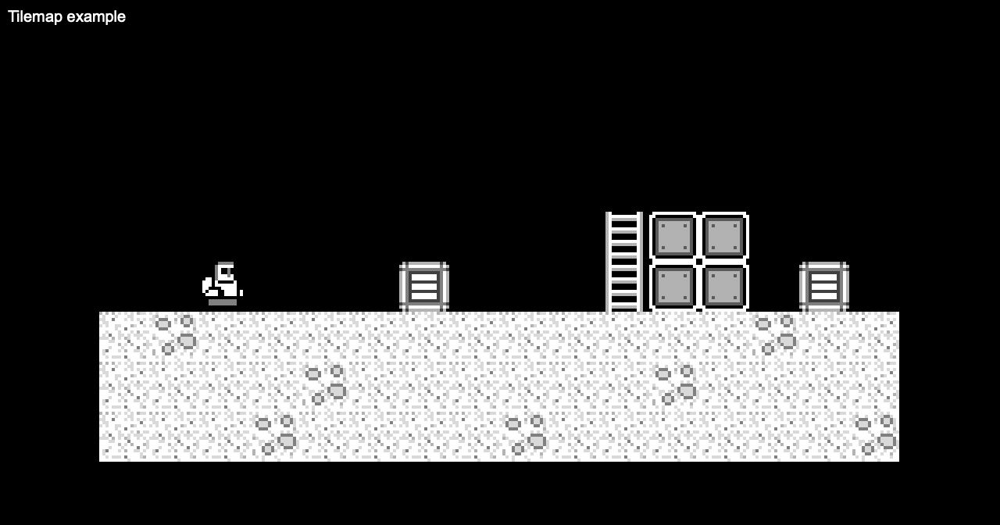

# LittleJS Tilemap Study

Learning to load tilemaps into the LittleJS game engine

The purpose of this project was to study the way LittleJS can build the map from a TMJ file (exported from Tiled)

I used the platformer example as a reference. For this example, I omitted collisions, and objects

